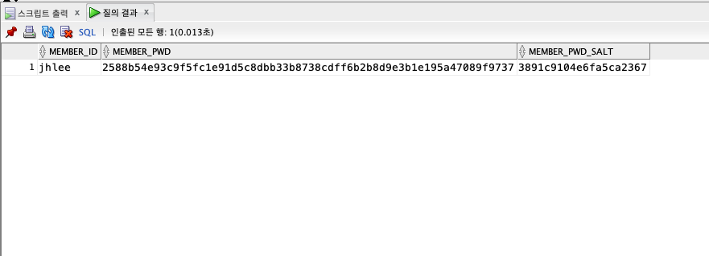

# Study about Encryption
- Hash, SHA-256, Salt, etc...
- ref. 노마드 코더(https://youtu.be/67UwxR3ts2E)

## 1. 잘못된 방법들
1. 비밀번호를 그대로 DB에 저장 -> DB에 접근 가능한 모든 사람이 볼 수 있다!!!
- 아주 잘못된 방법임(세미 때 시간이 없어서 이렇게 했지..)
2. 회사 측에서 비밀번호를 암호화시킴 -> User에게 키 발급
- 로그인 시 그 Key로 로그인하여 암호를 해제하고 비밀번호가 일치하면 로그인 성공.
  - 키를 잃어버리거나 누군가가 키를 훔치면 또 유출될 수 있다.
  - 그러므로 이 역시 User에게는 좋은 방법이 아니다.

그래서 알아야 하는 것이 `Hash` 함수

## 2. Hash 함수
- 입력한 값을 요상한 값으로 둔갑시킴

### 2.1. 특징
1. 동일한 입력값에 대한 동일한 출력값을 가지고 있다.
- Same Input -> Same Output
2. 입력값이 아주 살짝 변경되어도 출력값은 아주 많이 바뀐다.
- Little Diffrent Input -> Very Different Output
3. 항상 일방향으로만 움직인다.
### 2.2. 알고리즘
- 유저가 입력한 값을 해쉬 -> 못생긴 출력값이 나옴 -> 이 출력값을 DB에 저장한다.

## 3. Rainbow Table
- 해쉬화(?)된 출력값을 사용자가 입력한 값과 연결해놓은 태이블
- 해쉬된 값을 레인보우 테이블에서 찾으면 입력값을 찾을 수 있다.

## 4. Salt
- really tiny random piece of text
- 말 그대로 `출력값에 소금을 친다.`
  - 입력값과 salt와를 합쳐 해쉬한다 -> 아주 랜덤한 텍스트가 나온다.

## 5. 실습

### 5.1. MemberVo 클래스
- 임시로 아이디, 비밀번호, 솔트 값을 가진 Entity 생성
```java
package example.security.member.model.vo;

public class MemberVo {
	private String memberId;
	private String memberPwd;
	private String memberPwdSalt;
	
	
	public String getMemberId() {
		return memberId;
	}
	public void setMemberId(String memberId) {
		this.memberId = memberId;
	}
	public String getMemberPwd() {
		return memberPwd;
	}
	public void setMemberPwd(String memberPwd) {
		this.memberPwd = memberPwd;
	}
	public String getMemberPwdSalt() {
		return memberPwdSalt;
	}
	public void setMemberPwdSalt(String memberPwdSalt) {
		this.memberPwdSalt = memberPwdSalt;
	}
	
}
```

### 5.2. JDBC를 위한 준비
- Application.java 클래스, JdbcTemplate.java 클래스 생성

### 5.3. Dao, Service 클래스 작성
```java
package example.security.member.model.dao;

import java.sql.Connection;
import java.sql.PreparedStatement;
import java.sql.ResultSet;

import example.security.member.JdbcTemplate;
import example.security.member.model.vo.MemberVo;

public class MemberDao {

	public int signup(Connection conn, MemberVo memberVo) {
		PreparedStatement pstmt = null;
		int affectedRows = 0;

		try {
			String sql = "INSERT INTO member_temp VALUES(?, ?, ?)";

			pstmt = conn.prepareStatement(sql);
			pstmt.setString(1, memberVo.getMemberId());
			pstmt.setString(2, memberVo.getMemberPwd());
			pstmt.setString(3, memberVo.getMemberPwdSalt());

			affectedRows = pstmt.executeUpdate();
			System.out.println(affectedRows);
			
			if (affectedRows < 1) {
				System.out.println("회원가입 실패");
				JdbcTemplate.rollback(conn);
			}
			
		} catch (Exception e) {
			e.printStackTrace();
		} finally {
			JdbcTemplate.close(pstmt);
		}

		return affectedRows;
	}

	public int signin(Connection conn, String memberId, String memberPwd) {
		PreparedStatement pstmt = null;
		ResultSet rs = null;
		
		int affectedRows = 0;
		try {
			String sql = "SELECT COUNT(*) FROM member_temp WHERE member_id = ? AND member_pwd = ?";

			pstmt = conn.prepareStatement(sql);
			pstmt.setString(1, memberId);
			pstmt.setString(2, memberPwd);
			rs = pstmt.executeQuery();

			while(rs.next()) {
				affectedRows = rs.getInt(1);
			}
			System.out.println(affectedRows);
			
		} catch (Exception e) {
			e.printStackTrace();
		} finally {
			JdbcTemplate.close(pstmt);
			JdbcTemplate.close(rs);
		}

		return affectedRows;
	}
}
```
```java
package example.security.member.model.service;

import java.sql.Connection;

import example.security.member.Application;
import example.security.member.JdbcTemplate;
import example.security.member.model.dao.MemberDao;
import example.security.member.model.vo.MemberVo;

public class MemberService {
	
	public int signup(MemberVo memberVo) {
		int affectedRows = 0;
		
		try {
			Connection conn = new Application().getConn();
			affectedRows = new MemberDao().signup(conn, memberVo);
			JdbcTemplate.close(conn);
			
		} catch (Exception e) {
			e.printStackTrace();
		}
		
		return affectedRows;
	}
	
	public int signin(String memberId, String memberPwd) {
		int affectedRows = 0;
		
		try {
			Connection conn = new Application().getConn();
			affectedRows = new MemberDao().signin(conn, memberId, memberPwd);
			JdbcTemplate.close(conn);
			
		} catch (Exception e) {
			e.printStackTrace();
		}
		
		return affectedRows;
	}
	
}
```
- signup을 통해 회원가입(member_temp 테이블에 데이터 삽입) -> signin 메소드로 확인

### 5.4. 암호화 클래스 작성
```java
package example.security.salt;

import java.security.MessageDigest;
import java.security.SecureRandom;

public class Utils {
	
	public String getSalt() {
		
		SecureRandom secureRandom = new SecureRandom();
		byte[] salt = new byte[10];
		
		secureRandom.nextBytes(salt);
		
		StringBuffer sb = new StringBuffer();
		
		for (int i=0; i<salt.length; i++) {
			sb.append(String.format("%02x", salt[i])); // 바이트 값을 16진수로 변경 
		}
		
		return sb.toString();
	}
	
	public String getEncrypt(String pwd, String salt) {
		String result = pwd + salt;
		
		try {
			MessageDigest md = MessageDigest.getInstance("SHA-256");
			md.update(result.getBytes());
			
			byte[] b = md.digest();
			
			StringBuffer sb = new StringBuffer();
			
			for (int i=0; i<b.length; i++) {
				sb.append(Integer.toString((b[i] & 0xFF) + 256, 16).substring(1));
				
			}
			result = sb.toString();
		} catch (Exception e) {
			e.printStackTrace();
		}
		return result;
	}
	
	public String getEncrypt(String pwd) {
		String result = pwd;
		
		try {
			MessageDigest md = MessageDigest.getInstance("SHA-256");
			md.update(result.getBytes());
			
			byte[] b = md.digest();
			
			StringBuffer sb = new StringBuffer();
			
			for (int i=0; i<b.length; i++) {
				sb.append(Integer.toString((b[i] & 0xFF) + 256, 16).substring(1));
				
			}
			result = sb.toString();
		} catch (Exception e) {
			e.printStackTrace();
		}
		return result;
	}
	
}
```
- getEncrypt(String pwd, String salt)
  - 회원가입 시 사용자가 입력한 비밀번호와 발급된 salt 문자열을 합쳐 해시하기 위한 메소드
- getEncrypt(String pwd)
  - 로그인 시
  - 1. 사용자가 입력한 비밀번호를 해시
  - 2. DB에 저장된 해당 회원의 salt값과 합침 
  - 3. DB에 저장된 비밀번호(회원가입 시 저장했던 최종적으로 해시된 문자열)와 비교
  - 의 과정에서 1번에 사용되는 메소드

### 5.5. 실행시켜보기
```java
package example.security.member.controller;

import example.security.member.model.service.MemberService;
import example.security.member.model.vo.MemberVo;
import example.security.salt.Utils;

public class MemberController {

	public static void main(String[] args) {
		MemberVo memberVo = new MemberVo();
		Utils utils = new Utils();
		MemberService memberService = new MemberService();
		
		memberVo.setMemberId("jhlee2");
		memberVo.setMemberPwdSalt(utils.getSalt());
		memberVo.setMemberPwd(utils.getEncrypt("1234", memberVo.getMemberPwdSalt()));
		
		memberService.signup(memberVo);
    // 여기까지 회원가입
		
//    String result = utils.getEncrypt("사용자가 입력한 비밀번호", "DB에 저장된 해당 사용자의 salt 문자열");
		String result = utils.getEncrypt("1234", "3891c9104e6fa5ca2367");
		System.out.println(result);
		memberService.signin("jhlee", result);
	}
}

```
- signup 메소드까지 실행한 결과 <br/>
<br/>
- 로그인할 때는
  - 1. 사용자가 입력한 값을 해시해서
  - 2. DB에 있는 salt(member_pwd_salt)값을 가져온 뒤
  - 3. 1, 2를 합쳐 한 번 더 해시해서
  - 4. member_pwd 컬럼에 있는 값과 비교
  - 5. 일치하면 성공, 불일치하면 실패