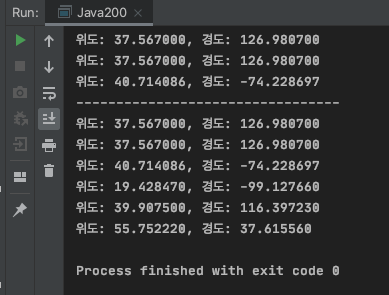

# 1. 유동성 인자
`...,`, `variable arguments`, `Var args`
- 복잡한 오버로딩의 수를 줄일 수 있음.
- 배열처럼 동작
- 인자 개수에 상관없이 메소드 하나만 있으면 모든 경우에 대해 실행됨.
- 인자가 하나만 있어도 되고, 배열이어도 가능함
Geo.java
```java
package com.java200.introduction;

public class Geo {
    private double latitude = 0.0;
    private double longtitude = 0.0;

    public Geo() {
        // 생성자 오버로딩
    }

    public Geo(double latitude, double longtitude) {
        this.latitude = latitude;
        this.longtitude = longtitude;
    }

    public double getLatitude() {
        return latitude;
    }

    public double getLongtitude() {
        return longtitude;
    }

    public void setLatitude(double latitude) {
        this.latitude = latitude;
    }

    public void setLongtitude(double longtitude) {
        this.longtitude = longtitude;
    }
}

```
GeoMain.java
```java
package com.java200.introduction;

public class GeoMain {
    public static void main(String[] args) {

        Geo seoul = new Geo(37.5670, 126.9807);
        Geo austria = new Geo(47.01, 10.2);
        Geo newyork = new Geo(40.714086, -74.228697);
        Geo mexico = new Geo(19.42847, -99.12766);
        Geo china = new Geo(39.9075, 116.39723);
        Geo russia = new Geo(55.75222, 37.61556);

        showGeo(seoul, seoul, newyork); // 3개 인자 
        System.out.println("---------------------------------");
        showGeo(seoul, seoul, newyork, mexico, china, russia); // 6개 인자 
    } 
        public static void showGeo(Geo ...goose) { // 인자가 여러 개 와도 된다.
            for(Geo gg : goose) {
                System.out.printf("위도: %f, 경도: %f\n", gg.getLatitude(), gg.getLongtitude());
            }
        }

    }

```
결과<br/>


# 2. 자료구조
## 2.1. List
```java
package com.java200.introduction;

import java.util.ArrayList;
import java.util.List;

public class ListExample {
    public static void main(String[] args) {
        List<Geo> geoList = new ArrayList<Geo>();
        geoList.clear(); // 내용을 지운다. 
        geoList.add(new Geo(37.5670, 126.9807)); // 저장한다.
        geoList.add(new Geo(47.01, 10.2));
        geoList.add(new Geo(40.714086, -74.228697));
        geoList.add(new Geo(19.42847, -99.12766));
        geoList.add(new Geo(39.9075, 116.39723));
        geoList.add(new Geo(55.75222, 37.61556));

        System.out.println(geoList.size()); // List의 크기를 반환한다.

        Geo geoGet = geoList.get(1); // index 1의 객체를 가져온다.
        System.out.printf("위도: %f, 경도: %f\n", geoGet.getLatitude(), geoGet.getLongtitude());
    }
}

```

## 2.2. Map
저장할 때 Key와 Value를 한 쌍으로 저장한 후, key를 이용하여 value를 찾음
```java
package com.java200.introduction;

import java.util.HashMap;
import java.util.Map;

public class MapExample {
    public static void main(String[] args) {
        Map<String, Geo> cities = new HashMap<String, Geo>();

        cities.clear();
        cities.put("Korea", new Geo(37.5670, 126.9807));
        cities.put("Austria", new Geo(47.01, 10.2));
        cities.put("US", new Geo(40.714086, -74.228697));
        cities.put("Mexico", new Geo(39.9075, 116.39723));
        cities.put("Russia", new Geo(55.75222, 37.61556));

        System.out.println(cities.size());
        System.out.println(cities.containsKey("Austria"));
        Geo geo = cities.get("Austria");
        System.out.printf("%s: 위도: %f, 경도: %f\n", "Austria", geo.getLatitude(), geo.getLongtitude());

    }

}
```

# 3. 날짜 관련 변환
자바는 날짜의 기준을 `1970.1.1.0.0.0(연도, 월, 날짜, 시간, 분, 초)`로 설정하고 상대적으로 얼마가 경과했는지를 이용함
- ex) 오늘이 1970.1.2.0.0.0이라면 `1*24*60*60*1000`(하루)가 경과한 것

```java
package com.java200.introduction;

import java.text.SimpleDateFormat;
import java.util.Calendar;
import java.util.Date;

public class DateConversion {
    public static void main(String[] args) {
        long millis = System.currentTimeMillis();
        int days = (int)(millis/1000/24/60/60); // 1970.1.1로부터 며칠?

        System.out.println(days); // 18636

        Date date = new Date(); // 오늘
        Date date2 = new Date(date.getTime() + 24 * 60 * 60* 1000); // 내일

        Calendar calendar = Calendar.getInstance();
        calendar.set(1970, 1-1, 1);  //java에서는 1~12월을 0~11월로 사용한다.

        Calendar today = Calendar.getInstance();
        long minus = today.getTimeInMillis() - calendar.getTimeInMillis(); // 현재-1970.1.1

        // Date를 String으로 변환
        SimpleDateFormat sdf = new SimpleDateFormat("yyyy-MM-dd");
        String tomorrow = sdf.format(date2);

        System.out.println(tomorrow); // 2021-01-10

    }

}
```

# 4. 메모리와 계층 구조의 특징
## 4.1. static
- 설계도, class, method 영역
- 객체 생성 없이 사용(클래스 이름, 메소드())
- 객체를 생성한다면 한 번만 생성(`싱글톤`)
- 컴파일된 메소드가 올라가는 영역
- 기간
  - 가장 길다.
  - 설계도가 필요없을 때까지(GC 대상)

## 4.2. stack
- FILO(Push and Pop)
- 객체 레퍼런스, 기본 타입
- 메소드 변수(아규먼트)
- 연산 과정, 블록 변수
- 기간
  - 가장 짧다.
  - 메소드나 블록이 끝날 때까지

## 4.3. heap
- 자유 저장 공간(인스턴스 저장)
- (키 : 레퍼런스 / 밸류 : 레퍼런스) 키로 밸류 찾음
- JVM이 관리(Object 상속 - managed)
- 객체 생성 후 사용(래퍼런스, 메소드())
- 참조 타입
- 기간
  - 중간
  - 객체가 더 이상 사용되지 않을 때까지(GC 대상)

# 5. instanceof 키워드
다형성의 원리(부모 타입으로 자식을 받을 수 있다) 때문에 자식이 여러 개인 경우는 생성된 객체의 인스턴스가 누구의 것인지 확인해야 함
- 이 때 인스턴스의 타입을 확인하는 키워드가 `instanceof`
