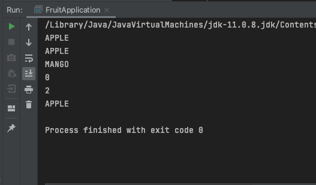

# 1. 자료 구조(Collection)와 파라미터화된 타입(Parameterized Type)
## 1.1. 자료 구조
### 1.1.1. Set
- 1) 순서에 관계없이 
- 2) 중복되지 않는 
- 데이터를 저장하고 싶을 때 사용
    - HashSet, TreeSet
### 1.1.2. List
- 1) 순서대로
- 2) 중복이 가능한 
- 데이터를 저장하고 싶을 때 사용
  - ArrayList, LinkedList, Vector
### 1.1.3. Map
- 1) Key와 Value를 한 쌍으로 저장하고
- 2) 해싱(hashing)을 사용하여 많은 양의 데이터를 검색할 때 뛰어난 성능을 보임
  - Hashtable, HashMap

## 1.2. 파라미터화된 타입(Parameterized Type)
- 직렬화한 모든 객체를 저장하고 싶을 때 사용

# 2. static 메소드
메소드에 `static` 키워드가 붙은 메소드. 객체 생성 없이 호출할 수 있음.
```java
package com.java200.intermediate;

public class BioCalendarByStatic {
    public static final int PHYSICAL = 23;

    public static double getBioRhythm(long days, int index, int max) {
        return max * Math.sin((days % index) * 2 * Math.PI / index);
    }

    public static void main(String[] args) {
        int days = 1200;

        double phyval = getBioRhythm(days, PHYSICAL, 100);
        System.out.printf("나의 신체 지수는 %1$.2f입니다.", phyval);
    }
}
```
# 3. 멤버 메소드(non-static method)
static이 붙지 않는 메소드. new 예약어를 이용해 객체를 생성한 후 쓸 수 있음.
```java
package com.java200.intermediate;


public class BioCalendarByNonStatic {
    public static final int PHYSICAL = 23;

    public double getBioRhythm(long days, int index, int max) {
        return max * Math.sin((days % index) * 2 * Math.PI / index);
    }

    public static void main(String[] args) {
        int days = 1200;
        BioCalendarByNonStatic bioCalendarByNonStatic = new BioCalendarByNonStatic();

        double phyval = bioCalendarByNonStatic.getBioRhythm(days, PHYSICAL, 100);
        System.out.printf("나의 신체 지수는 %1$.2f입니다.", phyval);
    }

}
```

# 4. enum(열거형) 사용하기
enumerated type. 서로 연관된 상수들의 집합. 완전한 기능을 갖춘 클래스임.
- FRUIT.java (enum)
```java
package com.java200.intermediate;

public enum FRUIT {
    APPLE,
    BANANA,
    MANGO
}
```
- FruitApplication.java
```java
package com.java200.intermediate;

public class FruitApplication {
    public static void main(String[] args) {
        FRUIT pineapple = FRUIT.APPLE;
        FRUIT applemango = FRUIT.MANGO;
        System.out.println(pineapple);
        System.out.println(pineapple.name());
        System.out.println(applemango.name());
        System.out.println(pineapple.ordinal());
        System.out.println(applemango.ordinal());

        FRUIT[] fruits = FRUIT.values();
        System.out.println(fruits[0]);
    }

}
```
- 결과

- 주의: enum을 int로 변환하거나 대입할 수 없음. 꼭 변환하고 싶다면 순서를 나타내는 `ordinal()`을 사용

# 5. 삼항 연산자
정말정말 너무 기초인데 잘 쓸 줄 몰라서 한 번 더 정리.
```java
package com.java200.intermediate;

public class EvenOddTriCondition {
    public static void main(String[] args) {
        int temp = 99;
        temp = (temp%2 == 1) ? temp * 3 + 1 : temp / 2;
        System.out.printf("계산 후 = %d", temp);
    }

}
```
- if ~ else 문으로 바꿔보면
```java
package com.java200.intermediate;

public class EvenOddIfCondition {
    public static void main(String[] args) {
        int temp = 99;

        if (temp % 2 == 1) {
            temp = temp * 3 + 1;
        } else {
            temp = temp / 2;
        }

        System.out.printf("계산 후 = %d", temp);
    }
}
```

# 6. 논리 연산자로 윤년 판별하기
```java
package com.java200.intermediate;

public class LeapYearCalendar {

    public boolean isLeapYear(int year) {
        boolean b = false;
        if ((year % 4 == 0) && (year % 100 != 0) || (year % 400 == 0)) {
            b = true;
        }

        return b;
    }

    public static void main(String[] args) {
        LeapYearCalendar leapYearCalendar = new LeapYearCalendar();
        System.out.println(leapYearCalendar.isLeapYear(2021));
    }
}

```
- 예전에 백준에서 풀었던 것도 첨부.
```java
import java.util.Scanner;
public class Ex03 {
	public static void main(String[] args) {
		final Scanner scan = new Scanner(System.in);
		System.out.print("계산하고 싶은 연도를 입력하세요: ");
		int year = scan.nextInt();
		
		// 윤년이면 1 출력 
		if (year%4 == 0 && year%100 != 0 || year%400 == 0) {
			System.out.println(1);
		}
		// 윤년이 아니면 0 출력 
		else
			System.out.println(0);
	}
}
```
