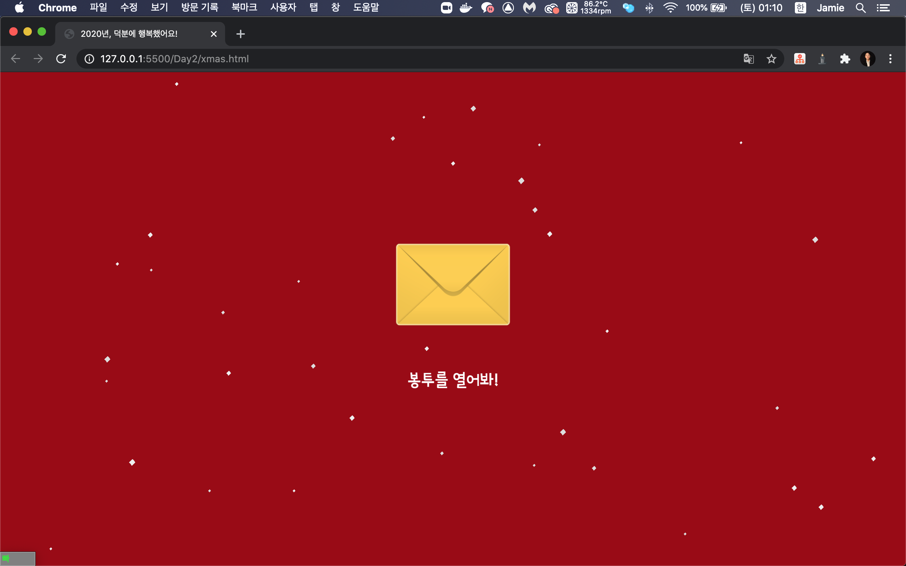

# 1. 봉투 html 만들기
익숙하지 않은 css 정리
## 1.1. box-shadow
박스에 그림자를 줌
```css
.rtan {
    border: 5px solid white;
    box-shadow: 0 0 10px white

}
```

1. 앞에 두 숫자: 그림자가 가로로 얼마나 치우칠 건지 정해줌
2. 세번째 숫자: 얼마나 뿌옇게 할 건지 정해줌
3. 네번째 숫자: 얼마나 길게 뿌옇게 할 건지 정해줌

# 2. 모바일 버전 처리
```@media screen and (max-width: 최대가로길이)```
- 넣어준 후 그 안에서 css 적용
```css
 /*mobile ver.*/ 
@media screen and (max-width: 760px) {
    .messagebox {
        width: 300px;
        padding: 20px;
    }

    .rtan {
        width: 150px;
        height: 150px;
        margin: 70px auto 0 auto;
        border-radius: 100%;
        border: 5px solid white;
        box-shadow: 0 0 10px 0 white;
    }

    .h1 {
        font-size: 28px;
    }

    .envelope {
        margin: 150px auto 0 auto;
    }
}
```

# 3. Javascript 맛보기
봉투 열 수 있게 만들어보기
1. <head> 끝나기 전에
```javascript
<script>
        function openLetter() {
            document.getElementsByClassName("letter-close")[0].style.display = 'none'
            document.getElementsByClassName("letter-open")[0].style.display = 'block'
        }
</script>
```
추가
2. 봉투 div에 `onclick="openLetter()"` 추가

# 4. 눈오는 효과 붙이기
라이브러리 찾아서 넣기
- 구글링 잘하기(ex. snow javascript)
- title 아래에
```html
<script src="https://s3.ap-northeast-2.amazonaws.com/materials.spartacodingclub.kr/xmas/snow.js"></script>
```
추가<br/>
<br/>
눈 오는 효과 적용 완료!

# 5. og 태그 넣기
카카오톡으로 링크 공유할 때 뜨는 미리보기 이미지를 위한 태그.
```html
<meta property="og:image" content="https://www.christmastreeassociation.org/wp-content/uploads/2016/06/multiple-christmas-trees-in-one-household-800x400.jpg">
<meta property="og:title" content="지현이의 카드">
<meta property="og:description" content="2020년을 보내며">
```
- `og:image`: 미리보기 이미지
- `og:title`: 미리보기 타이틀
- `og:description`: 타이틀 아래의 간략한 설명

# 6. favicon
html 페이지를 웹에서 열었을 때 타이틀 왼쪽에 조그맣게 뜨는 아이콘
```html
<link rel="shortcut icon" href="https://freepngimg.com/download/christmas/26196-6-christmas-stocking.png">
```